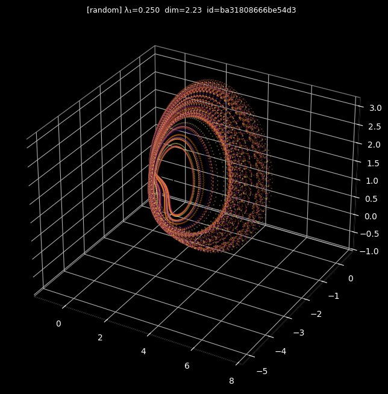
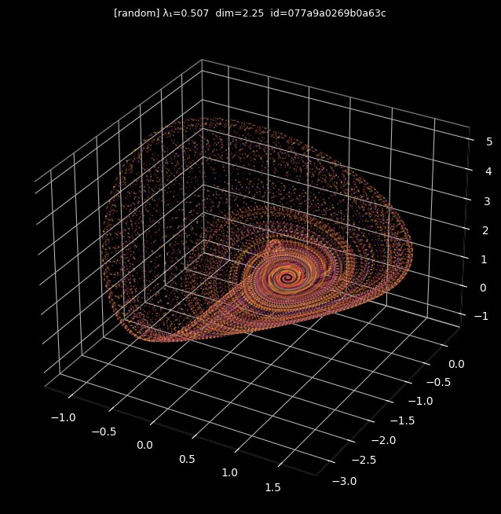
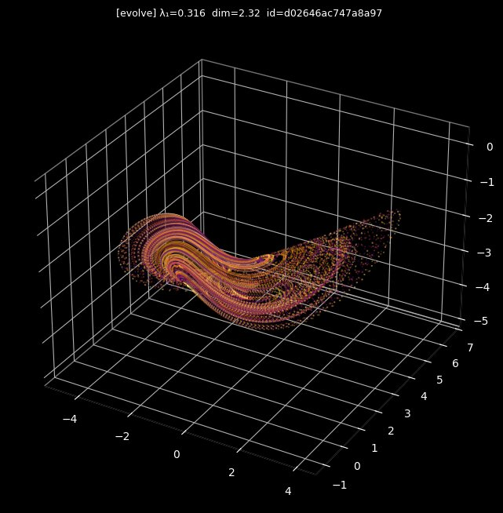
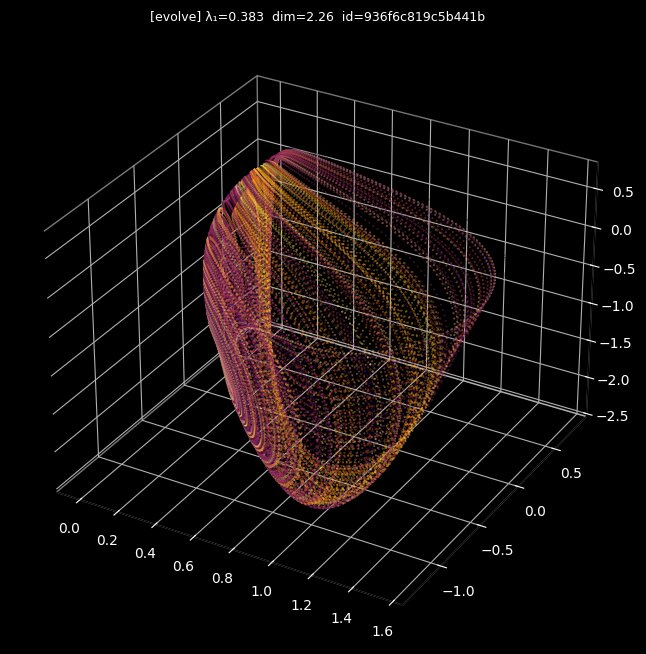

# attractor-search

Autonomous discovery of strange attractors that
don't exist in the literature. Searches the space
of 3D quadratic polynomial ODE systems, classifies
dynamics via Lyapunov exponents, catalogues novel
chaotic objects.

## Background

If this is unfamiliar territory, here's a short primer.

### Dynamical systems

A dynamical system is a rule that tells you how something
changes over time. You have some *state* — a set of numbers
describing "where you are" — and a rule that says, given
where you are now, here's where you'll be next.

The simplest example: a ball rolling in a bowl. The state
is the ball's position and velocity. The rule is physics.
At every moment, the current state determines what happens
next. The ball traces out a path through the space of all
possible states — this path is called a *trajectory*, and
the space itself is called *phase space*.

Mathematically, these systems are expressed as differential
equations. This project searches over 3D quadratic
polynomial ODEs — systems of the form:

```
dx/dt = a₀ + a₁x + a₂y + a₃z + a₄x² + a₅y² + a₆z² + a₇xy + a₈xz + a₉yz
dy/dt = b₀ + b₁x + b₂y + b₃z + b₄x² + b₅y² + b₆z² + b₇xy + b₈xz + b₉yz
dz/dt = c₀ + c₁x + c₂y + c₃z + c₄x² + c₅y² + c₆z² + c₇xy + c₈xz + c₉yz
```

Each equation has 10 terms (1 constant + 3 linear + 6
quadratic), so the full system is defined by 30 real-valued
coefficients. The search space is all possible assignments
of these coefficients in [-2, 2]. For reference, the
classic Lorenz system is a single point in this
30-dimensional space — most coefficients zero, a handful
set to specific values (10, 28, 8/3).

Dynamical systems of this kind describe everything from
planetary orbits to population dynamics to weather.

### Attractors

Many systems, no matter where you start them, eventually
settle into the same long-term behavior. The thing they
settle into is the *attractor*. There are a few types:

- **Fixed point** — the system reaches a single state and
  stays there. A ball at the bottom of a bowl.
- **Limit cycle** — the system settles into a repeating
  loop. A heartbeat, a pendulum.
- **Strange attractor** — the system never repeats, but
  never leaves a bounded region. The trajectory folds and
  stretches back on itself forever, tracing out an
  infinitely detailed geometric structure — a fractal.

### What makes strange attractors "strange"

Two things:

1. **Sensitive dependence on initial conditions.** Two
   trajectories that start incredibly close together
   diverge exponentially fast. This is "chaos." The rate
   of divergence is measured by the *Lyapunov exponent*
   (λ₁). Positive λ₁ = chaotic.

2. **Fractal structure.** The attractor has a non-integer
   dimension. It's not a line (dimension 1) or a surface
   (dimension 2) — it's something in between, like 2.23.
   This is the *Kaplan-Yorke dimension*. It means the
   attractor has structure at every scale, infinitely
   nested.

So the system is simultaneously *deterministic* (the rules
completely determine the future) and *unpredictable* (tiny
measurement errors grow exponentially). This is why
long-term weather forecasting is fundamentally limited —
the atmosphere is a chaotic dynamical system.

### Kaplan-Yorke dimension in plain terms

The KY dimension tells you how much of the available space
the attractor fills. These systems live in 3D, so the
trajectory *could* fill a volume (dimension 3), but
attractors are constrained. Dimension 1 is a thin curve.
Dimension 2 is a surface. A strange attractor lands in
between — a surface folded so aggressively it partially
fills a volume. A dimension of 2.23 means a 2D sheet
folded until it's 23% of the way toward filling 3D space.
Higher dimension = more folds, more structure, more
intricate geometry.

## Why

Strange attractors live on a fractal boundary
between divergence and collapse. That boundary
has measure zero. Most of it has never been
explored. Sprott found ~19 in the 90s by brute
force. This is the systematic version.

## Run

```bash
cargo build --release

# random search — sample 50k systems
./target/release/attractor-search random \
  --count 50000

# evolutionary — breed for chaos
./target/release/attractor-search evolve \
  --generations 200 --pop 100
```

Discovered attractors saved as JSON in `results/`.

Visualize the top finds:

```bash
python visualize.py
# gallery at gallery/index.html
```

## How it works

Each candidate system has 30 coefficients defining
a 3D quadratic ODE. The pipeline:

1. RK4 integrate forward
2. Early reject: divergent or collapsed
3. Compute full Lyapunov spectrum
4. Positive λ₁ + bounded = chaotic → catalogue it

Random search hits chaos ~0.5% of the time.
Evolutionary search hits ~29% by breeding for
positive Lyapunov exponents.

## Results so far

**2,045 chaotic systems** catalogued from ~60k
evaluations across two search methods:

- **Random**: 246 from 50k evals (0.49%)
- **Evolutionary**: 1,799 from 10k evals (17.9%)

Top finds have Kaplan-Yorke dimension >2.3 and
Lyapunov exponents in the 0.1–0.5 range (moderate
chaos with visible geometric structure).

Each entry is tagged with its search method.
Gallery renders the top 15 from each, ranked by
fractal dimension + moderate λ₁.

### Sample discoveries

| Random search | | Evolutionary search | |
|:---:|:---:|:---:|:---:|
|  |  |  |  |
| λ₁=0.250 dim=2.23 | λ₁=0.507 dim=2.25 | λ₁=0.316 dim=2.32 | λ₁=0.383 dim=2.26 |

See `gallery/index.html` for the full top-30 gallery.

## Novelty

These systems use arbitrary real-valued
coefficients in [-2, 2] — a vastly larger space
than Sprott's integer-coefficient search. The
specific coefficient combinations found are almost
certainly not in any published catalogue.

Topological novelty (genuinely new attractor
classes vs. deformations of known types) is an
open question requiring comparison of topological
invariants against known systems.

## Prior art

- Sprott (1994) — found 19 simple chaotic systems
  with quadratic nonlinearities
- Sprott (2000) — systematic search of 3D quadratic
  systems with fewer terms
- Gilmore & Letellier — topological characterization
  of attractors via template theory
